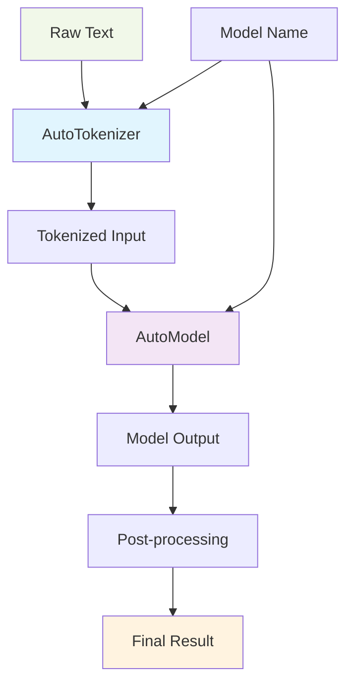
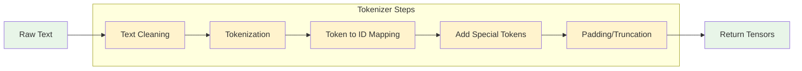

# 🤖 Auto Models và Tokenizers - Hướng dẫn toàn diện

## 📋 Tổng quan

Auto Classes trong Hugging Face Transformers cung cấp cách tiếp cận linh hoạt và mạnh mẽ để làm việc với models và tokenizers, cho phép kiểm soát chi tiết hơn so với Pipelines.

## 🔄 So sánh Pipelines vs Auto Classes

| Tiêu chí | Pipelines | Auto Classes |
|----------|-----------|--------------|
| **Độ dễ sử dụng** | ⭐⭐⭐⭐⭐ Rất đơn giản | ⭐⭐⭐ Cần hiểu biết |
| **Tính linh hoạt** | ⭐⭐ Hạn chế | ⭐⭐⭐⭐⭐ Rất linh hoạt |
| **Kiểm soát** | ⭐⭐ Tự động | ⭐⭐⭐⭐⭐ Kiểm soát hoàn toàn |
| **Tùy chỉnh** | ⭐ Khó tùy chỉnh | ⭐⭐⭐⭐⭐ Tùy chỉnh sâu |
| **Use case** | Prototype nhanh | Production, Custom workflows |

## 🎯 Khi nào sử dụng Auto Classes?

### ✅ Nên sử dụng khi:
- Cần tùy chỉnh preprocessing chi tiết
- Muốn kiểm soát tokenization process
- Xây dựng custom pipeline phức tạp
- Cần fine-tune thresholds và weights
- Tích hợp vào production workflows

### ❌ Không cần thiết khi:
- Chỉ cần kết quả nhanh cho demo
- Không cần tùy chỉnh gì đặc biệt
- Mới bắt đầu học Hugging Face

## 🏗️ Kiến trúc Auto Classes



## 🔧 Auto Classes chính

### 1. 🤖 AutoModel Classes

| Class | Mục đích | Ví dụ sử dụng |
|-------|----------|---------------|
| `AutoModel` | Base model cho feature extraction | Embedding, representations |
| `AutoModelForSequenceClassification` | Text classification | Sentiment analysis, spam detection |
| `AutoModelForTokenClassification` | Token-level classification | NER, POS tagging |
| `AutoModelForQuestionAnswering` | Question answering | Reading comprehension |
| `AutoModelForMaskedLM` | Masked language modeling | BERT-style pretraining |
| `AutoModelForCausalLM` | Causal language modeling | GPT-style text generation |

### 2. 🔤 AutoTokenizer

| Tính năng | Mô tả | Code example |
|-----------|-------|--------------|
| **Tokenization** | Chia text thành tokens | `tokenizer.tokenize(text)` |
| **Encoding** | Convert tokens to IDs | `tokenizer.encode(text)` |
| **Batch processing** | Xử lý nhiều texts cùng lúc | `tokenizer(texts, padding=True)` |
| **Special tokens** | Thêm [CLS], [SEP], etc. | `tokenizer(text, add_special_tokens=True)` |

## 💻 Code Examples

### Ví dụ 1: Text Classification cơ bản

```python
from transformers import AutoTokenizer, AutoModelForSequenceClassification
import torch

# 1. Load model và tokenizer
model_name = "distilbert-base-uncased-finetuned-sst-2-english"
tokenizer = AutoTokenizer.from_pretrained(model_name)
model = AutoModelForSequenceClassification.from_pretrained(model_name)

# 2. Prepare input
text = "I love this product!"
inputs = tokenizer(text, return_tensors="pt", padding=True, truncation=True)

# 3. Model inference
with torch.no_grad():
    outputs = model(**inputs)
    predictions = torch.nn.functional.softmax(outputs.logits, dim=-1)

# 4. Get results
predicted_class = torch.argmax(predictions, dim=-1)
confidence = torch.max(predictions).item()

print(f"Prediction: {predicted_class.item()}")
print(f"Confidence: {confidence:.4f}")
```

### Ví dụ 2: Custom Pipeline

```python
from transformers import AutoTokenizer, AutoModelForSequenceClassification, pipeline

# Load components
model_name = "cardiffnlp/twitter-roberta-base-sentiment-latest"
tokenizer = AutoTokenizer.from_pretrained(model_name)
model = AutoModelForSequenceClassification.from_pretrained(model_name)

# Create custom pipeline
sentiment_pipeline = pipeline(
    "sentiment-analysis",
    model=model,
    tokenizer=tokenizer,
    device=0 if torch.cuda.is_available() else -1
)

# Use pipeline
texts = [
    "Tôi rất thích sản phẩm này!",
    "Dịch vụ khách hàng tệ quá",
    "Sản phẩm bình thường, không có gì đặc biệt"
]

results = sentiment_pipeline(texts)
for text, result in zip(texts, results):
    print(f"Text: {text}")
    print(f"Sentiment: {result['label']} ({result['score']:.4f})")
    print("-" * 50)
```

### Ví dụ 3: Batch Processing với Tokenizer

```python
from transformers import AutoTokenizer

tokenizer = AutoTokenizer.from_pretrained("bert-base-uncased")

# Batch tokenization
texts = [
    "Hello world!",
    "This is a longer sentence that needs tokenization.",
    "Short text."
]

# Tokenize với padding và truncation
encoded = tokenizer(
    texts,
    padding=True,           # Pad to same length
    truncation=True,        # Truncate long sequences
    max_length=128,         # Maximum sequence length
    return_tensors="pt"     # Return PyTorch tensors
)

print("Input IDs shape:", encoded['input_ids'].shape)
print("Attention mask shape:", encoded['attention_mask'].shape)

# Decode để xem tokens
for i, text in enumerate(texts):
    tokens = tokenizer.tokenize(text)
    print(f"Original: {text}")
    print(f"Tokens: {tokens}")
    print(f"Token IDs: {encoded['input_ids'][i][:len(tokens)+2]}")  # +2 for [CLS] and [SEP]
    print("-" * 50)
```

## 🔄 Tokenization Process Flow



## ⚙️ Advanced Techniques

### 1. Custom Preprocessing

```python
from transformers import AutoTokenizer

class CustomTokenizer:
    def __init__(self, model_name):
        self.tokenizer = AutoTokenizer.from_pretrained(model_name)
    
    def preprocess_vietnamese(self, text):
        """Custom preprocessing cho tiếng Việt"""
        # Remove extra whitespace
        text = " ".join(text.split())
        
        # Normalize Vietnamese characters
        text = text.replace("đ", "d").replace("Đ", "D")
        
        # Add custom processing here
        return text
    
    def encode_with_preprocessing(self, text, **kwargs):
        """Encode với custom preprocessing"""
        processed_text = self.preprocess_vietnamese(text)
        return self.tokenizer(processed_text, **kwargs)

# Usage
custom_tokenizer = CustomTokenizer("vinai/phobert-base")
result = custom_tokenizer.encode_with_preprocessing("Xin chào Việt Nam!")
```

### 2. Dynamic Thresholding

```python
import torch
from transformers import AutoModelForSequenceClassification, AutoTokenizer

class SentimentClassifier:
    def __init__(self, model_name, custom_thresholds=None):
        self.tokenizer = AutoTokenizer.from_pretrained(model_name)
        self.model = AutoModelForSequenceClassification.from_pretrained(model_name)
        
        # Custom thresholds cho từng class
        self.thresholds = custom_thresholds or {
            'NEGATIVE': 0.6,
            'NEUTRAL': 0.3,
            'POSITIVE': 0.7
        }
    
    def predict_with_confidence(self, text):
        inputs = self.tokenizer(text, return_tensors="pt", truncation=True, padding=True)
        
        with torch.no_grad():
            outputs = self.model(**inputs)
            probabilities = torch.nn.functional.softmax(outputs.logits, dim=-1)
        
        # Apply custom thresholds
        predicted_class = torch.argmax(probabilities, dim=-1).item()
        confidence = torch.max(probabilities).item()
        
        labels = ['NEGATIVE', 'NEUTRAL', 'POSITIVE']  # Adjust based on your model
        predicted_label = labels[predicted_class]
        
        # Check if confidence meets threshold
        meets_threshold = confidence >= self.thresholds[predicted_label]
        
        return {
            'label': predicted_label,
            'confidence': confidence,
            'meets_threshold': meets_threshold,
            'all_scores': {label: prob.item() for label, prob in zip(labels, probabilities[0])}
        }

# Usage
classifier = SentimentClassifier(
    "cardiffnlp/twitter-roberta-base-sentiment-latest",
    custom_thresholds={'NEGATIVE': 0.8, 'NEUTRAL': 0.5, 'POSITIVE': 0.7}
)

result = classifier.predict_with_confidence("This product is amazing!")
print(result)
```

## 📊 Performance Optimization

### Best Practices Summary

| Technique | Mô tả | Impact |
|-----------|-------|---------|
| **Batch Processing** | Process nhiều texts cùng lúc | 🚀 3-5x faster |
| **GPU Acceleration** | Sử dụng CUDA nếu có | 🚀 10-50x faster |
| **Model Quantization** | Giảm precision để tăng tốc | ⚡ 2-4x faster, ít RAM |
| **Caching** | Cache tokenized inputs | 💾 Giảm repeated computation |
| **Truncation** | Giới hạn sequence length | ⚡ Giảm memory usage |

### Performance Code Example

```python
import torch
from transformers import AutoTokenizer, AutoModelForSequenceClassification

class OptimizedClassifier:
    def __init__(self, model_name, device=None):
        self.device = device or ('cuda' if torch.cuda.is_available() else 'cpu')
        self.tokenizer = AutoTokenizer.from_pretrained(model_name)
        self.model = AutoModelForSequenceClassification.from_pretrained(model_name)
        self.model.to(self.device)
        self.model.eval()  # Set to evaluation mode
        
    def predict_batch(self, texts, batch_size=32):
        """Batch prediction cho performance tốt hơn"""
        results = []
        
        for i in range(0, len(texts), batch_size):
            batch_texts = texts[i:i + batch_size]
            
            # Tokenize batch
            inputs = self.tokenizer(
                batch_texts,
                return_tensors="pt",
                padding=True,
                truncation=True,
                max_length=512
            ).to(self.device)
            
            # Predict
            with torch.no_grad():
                outputs = self.model(**inputs)
                probabilities = torch.nn.functional.softmax(outputs.logits, dim=-1)
                
            # Process results
            for j, probs in enumerate(probabilities):
                predicted_class = torch.argmax(probs).item()
                confidence = torch.max(probs).item()
                
                results.append({
                    'text': batch_texts[j],
                    'prediction': predicted_class,
                    'confidence': confidence
                })
        
        return results

# Usage
classifier = OptimizedClassifier("distilbert-base-uncased-finetuned-sst-2-english")

texts = [
    "I love this!",
    "This is terrible",
    "Average product",
    # ... more texts
]

results = classifier.predict_batch(texts, batch_size=16)
```

## 🚨 Common Issues và Solutions

### Issue 1: Tokenizer Mismatch
```python
# ❌ Wrong - Using different tokenizers
model = AutoModelForSequenceClassification.from_pretrained("bert-base-uncased")
tokenizer = AutoTokenizer.from_pretrained("distilbert-base-uncased")  # Wrong!

# ✅ Correct - Matching tokenizer và model
model_name = "bert-base-uncased"
model = AutoModelForSequenceClassification.from_pretrained(model_name)
tokenizer = AutoTokenizer.from_pretrained(model_name)  # Same model name
```

### Issue 2: Memory Issues với Long Sequences
```python
# ❌ Memory intensive
inputs = tokenizer(very_long_text, return_tensors="pt")  # No truncation

# ✅ Memory efficient
inputs = tokenizer(
    very_long_text, 
    return_tensors="pt",
    truncation=True,
    max_length=512,  # Reasonable limit
    padding=True
)
```

### Issue 3: Slow Inference
```python
# ❌ Slow - Processing one by one
for text in texts:
    result = model(tokenizer(text, return_tensors="pt"))

# ✅ Fast - Batch processing
inputs = tokenizer(texts, return_tensors="pt", padding=True, truncation=True)
results = model(**inputs)
```

## 📝 Cheat Sheet

### Quick Commands

```python
# Load model và tokenizer
from transformers import AutoTokenizer, AutoModelForSequenceClassification

model_name = "your-model-name"
tokenizer = AutoTokenizer.from_pretrained(model_name)
model = AutoModelForSequenceClassification.from_pretrained(model_name)

# Single prediction
text = "Your text here"
inputs = tokenizer(text, return_tensors="pt")
outputs = model(**inputs)
prediction = torch.argmax(outputs.logits, dim=-1)

# Batch prediction
texts = ["Text 1", "Text 2", "Text 3"]
inputs = tokenizer(texts, return_tensors="pt", padding=True, truncation=True)
outputs = model(**inputs)
predictions = torch.argmax(outputs.logits, dim=-1)
```

## 🎓 Kết luận

Auto Classes cung cấp sự linh hoạt và kiểm soát cao cho việc xây dựng các ứng dụng NLP production-ready. Việc hiểu rõ cách thức hoạt động của AutoModel và AutoTokenizer sẽ giúp bạn:

- ✅ Tùy chỉnh preprocessing theo nhu cầu cụ thể
- ✅ Tối ưu performance cho production
- ✅ Xây dựng custom workflows phức tạp
- ✅ Debug và troubleshoot hiệu quả

### Next Steps:
1. Thực hành với các model khác nhau
2. Tìm hiểu về fine-tuning
3. Khám phá advanced tokenization techniques
4. Học cách deploy models lên production

---

**💡 Pro Tip**: Luôn sử dụng cùng tokenizer với model để đảm bảo consistency và accuracy tốt nhất!
