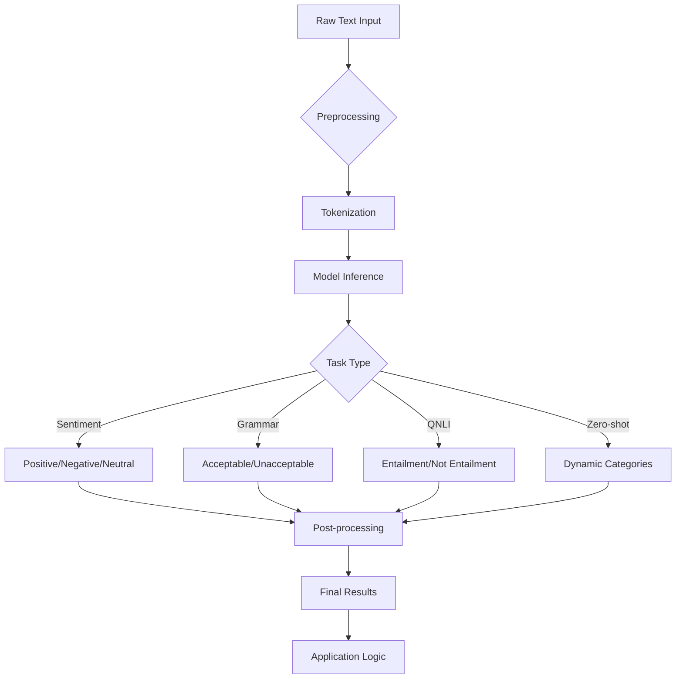

# Text Classification với Hugging Face

## 📋 Tổng quan

Text Classification là kỹ thuật machine learning phân loại văn bản vào các danh mục định sẵn. Đây là một trong những tác vụ phổ biến nhất trong NLP, được ứng dụng rộng rãi trong thực tế.

## 🎯 Các loại Text Classification

### 1. Sentiment Analysis (Phân tích Cảm xúc)

**Mục đích:** Phân loại văn bản dựa trên cảm xúc/thái độ

| Ví dụ Input | Label | Confidence |
|-------------|-------|------------|
| "I love pineapple on pizza" | Positive | 0.95 |
| "I dislike pineapple on pizza" | Negative | 0.89 |

**Ứng dụng thực tế:**
- Phân tích review sản phẩm
- Monitoring social media
- Đánh giá feedback khách hàng

### 2. Grammatical Correctness (Kiểm tra Ngữ pháp)

**Mục đích:** Kiểm tra tính đúng đắn về ngữ pháp

| Ví dụ Input | Label | Mô tả |
|-------------|-------|-------|
| "This course is great!" | Acceptable | Ngữ pháp đúng |
| "Course is gravy" | Unacceptable | Ngữ pháp sai |
| "He eat pizza every day" | LABEL_0 (Incorrect) | Thiếu 's' trong 'eats' |

**Ứng dụng thực tế:**
- Grammar checkers
- Language learning tools
- Content editing systems

### 3. QNLI (Question Natural Language Inference)

**Mục đích:** Kiểm tra xem premise có trả lời được question không

| Question | Premise | Label | Mô tả |
|----------|---------|-------|-------|
| "What state is Hollywood in?" | "Hollywood is in California" | Entailment (True) | Premise trả lời được question |
| "What state is Hollywood in?" | "Hollywood is known for movies" | Not Entailment (False) | Premise không trả lời question |

**Ứng dụng thực tế:**
- Question-answering systems
- Fact-checking applications
- Search engines

### 4. Dynamic Category Assignment (Phân loại Động)

**Mục đích:** Phân loại văn bản vào các danh mục định sẵn

| Ví dụ Input | Categories | Top Prediction |
|-------------|------------|----------------|
| "I want to know about pricing" | Sales, Marketing, Support | Sales (0.85) |
| "Feature our courses in newsletter" | Marketing, Sales, Support | Support (0.72) |

**Ứng dụng thực tế:**
- Content moderation
- Email routing
- Recommendation systems

## 🔧 Implementation Guide

### Sentiment Analysis
```python
from transformers import pipeline

# Tạo pipeline
classifier = pipeline("text-classification", 
                     model="cardiffnlp/twitter-roberta-base-sentiment-latest")

# Sử dụng
result = classifier("I love this product!")
print(f"Label: {result[0]['label']}, Score: {result[0]['score']:.3f}")
```

### Grammatical Correctness
```python
from transformers import pipeline

# Model cho grammar checking
grammar_checker = pipeline("text-classification", 
                          model="textattack/roberta-base-CoLA")

result = grammar_checker("He eat pizza every day")
print(f"Grammar: {result[0]['label']}, Confidence: {result[0]['score']:.3f}")
```

### QNLI
```python
from transformers import pipeline

# QNLI pipeline
qnli_classifier = pipeline("text-classification", 
                          model="roberta-large-mnli")

# Format: "question, premise"
text = "What state is Hollywood in?, Hollywood is in California"
result = qnli_classifier(text)
print(f"Entailment: {result[0]['label']}, Score: {result[0]['score']:.3f}")
```

### Zero-shot Classification
```python
from transformers import pipeline

# Zero-shot classifier
classifier = pipeline("zero-shot-classification")

text = "Hey, DataCamp; we would like to feature your courses!"
candidate_labels = ["Marketing", "Sales", "Support"]

result = classifier(text, candidate_labels)
print(f"Top category: {result['labels'][0]}")
print(f"Confidence: {result['scores'][0]:.3f}")
```

## 📊 So sánh các phương pháp

| Loại | Use Case | Model Example | Pros | Cons |
|------|----------|---------------|------|------|
| **Sentiment Analysis** | Review analysis | `cardiffnlp/twitter-roberta-base-sentiment` | ✅ Accuracy cao<br>✅ Domain specific | ❌ Limited to sentiment only |
| **Grammar Check** | Content editing | `textattack/roberta-base-CoLA` | ✅ Fast inference<br>✅ Clear binary output | ❌ No correction suggestions |
| **QNLI** | Q&A systems | `roberta-large-mnli` | ✅ Logical reasoning<br>✅ Fact verification | ❌ Requires structured input |
| **Zero-shot** | Dynamic categories | `facebook/bart-large-mnli` | ✅ Flexible categories<br>✅ No retraining needed | ❌ Lower accuracy<br>❌ Slower inference |

## 🚧 Thách thức và Giải pháp

### 1. **Ambiguity (Tính Mơ hồ)**
```
❌ Vấn đề: "This is sick!" (có thể là tích cực hoặc tiêu cực)
✅ Giải pháp: Context-aware models, domain-specific training
```

### 2. **Sarcasm/Irony (Châm biếm/Mỉa mai)**
```
❌ Vấn đề: "Great! Another bug in production 🙄"
✅ Giải pháp: Multi-modal analysis (text + emoji), advanced models
```

### 3. **Multilingual Complexity (Đa ngôn ngữ)**
```
❌ Vấn đề: "Sản phẩm này rất tuyệt vời!" (Tiếng Việt)
✅ Giải pháp: Multilingual models (mBERT, XLM-R), language detection
```

## 🔄 Text Classification Workflow



## 💡 Best Practices

### 1. **Model Selection**
- **Sentiment Analysis**: Chọn model train trên domain tương tự (social media, reviews, etc.)
- **Grammar Check**: Sử dụng models train trên CoLA dataset
- **QNLI**: Models train trên MNLI/SNLI datasets
- **Zero-shot**: BART hoặc T5-based models

### 2. **Performance Optimization**
```python
# Batch processing cho hiệu suất tốt hơn
texts = ["Text 1", "Text 2", "Text 3"]
results = classifier(texts, batch_size=8)

# Sử dụng GPU nếu có
classifier = pipeline("text-classification", 
                     model="model-name", 
                     device=0)  # GPU device
```

### 3. **Error Handling**
```python
try:
    result = classifier(text)
    if result[0]['score'] < 0.7:
        print("⚠️ Low confidence prediction")
except Exception as e:
    print(f"❌ Classification failed: {e}")
```

## 📈 Evaluation Metrics

| Metric | Formula | Use Case |
|--------|---------|----------|
| **Accuracy** | `(TP + TN) / Total` | Overall performance |
| **Precision** | `TP / (TP + FP)` | False positive sensitivity |
| **Recall** | `TP / (TP + FN)` | False negative sensitivity |
| **F1-Score** | `2 * (Precision * Recall) / (Precision + Recall)` | Balanced metric |
| **Confidence** | Model output probability | Prediction reliability |

## 🎯 Production Considerations

### 1. **Latency Requirements**
- **Real-time**: DistilBERT, MobileBERT (< 100ms)
- **Batch processing**: RoBERTa, BERT (< 1s)
- **High accuracy**: Large models (1-5s acceptable)

### 2. **Scalability**
```python
# Async processing cho high throughput
import asyncio
from transformers import pipeline

async def classify_batch(texts):
    classifier = pipeline("text-classification")
    return classifier(texts)

# Load balancing multiple models
```

### 3. **Monitoring**
- Track prediction confidence scores
- Monitor classification distribution
- Set up alerts for accuracy drops

## 🔗 Useful Resources

- **Hugging Face Models**: [huggingface.co/models](https://huggingface.co/models?pipeline_tag=text-classification)
- **Datasets**: [huggingface.co/datasets](https://huggingface.co/datasets?task_categories=task_categories:text-classification)
- **Documentation**: [transformers documentation](https://huggingface.co/docs/transformers/tasks/sequence_classification)

---

## 🏃‍♂️ Quick Start

1. **Install dependencies**:
   ```bash
   pip install transformers torch
   ```

2. **Run basic classification**:
   ```python
   from transformers import pipeline
   
   classifier = pipeline("text-classification")
   result = classifier("I love machine learning!")
   print(result)
   ```

3. **Experiment with different tasks** trong các examples ở trên

4. **Integrate vào application** của bạn với proper error handling và monitoring
