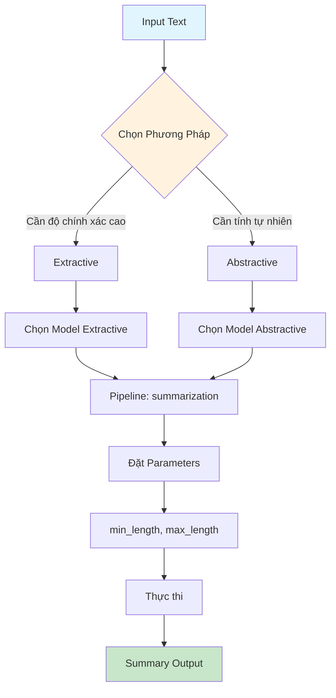

# Text Summarization với Hugging Face

## 📋 Tổng Quan

Text Summarization là quá trình rút gọn một đoạn văn bản dài thành phiên bản ngắn hơn trong khi vẫn giữ lại các thông tin quan trọng nhất.

## 🎯 Hai Phương Pháp Chính

### 📊 So Sánh Extractive vs Abstractive

| Tiêu chí | Extractive Summarization | Abstractive Summarization |
|----------|-------------------------|---------------------------|
| **Định nghĩa** | Chọn các câu quan trọng từ văn bản gốc | Tạo ra văn bản mới thể hiện ý chính |
| **Phương pháp** | Trích xuất câu có sẵn | Sinh văn bản mới |
| **Tài nguyên** | Ít tài nguyên tính toán | Nhiều tài nguyên tính toán |
| **Độ chính xác** | Cao (không tạo thông tin mới) | Trung bình (có thể tạo thông tin sai) |
| **Tính linh hoạt** | Thấp (giữ nguyên câu gốc) | Cao (diễn đạt linh hoạt) |
| **Khả năng đọc** | Có thể kém mạch lạc | Tự nhiên và dễ đọc hơn |

### 🔄 Workflow Summarization



## 🚀 Cách Triển Khai

### 1. Extractive Summarization

```python
from transformers import pipeline

# Tạo pipeline cho extractive summarization
summarizer = pipeline(
    task="summarization",
    model="sshleifer/distilbart-cnn-6-6"  # Model cho extractive
)

# Input text
text = """
Data Science là lĩnh vực kết hợp thống kê, khoa học máy tính 
và kiến thức chuyên môn để trích xuất insights từ dữ liệu...
"""

# Thực hiện summarization
summary = summarizer(text, max_length=100, min_length=30)
print(summary[0]['summary_text'])
```

### 2. Abstractive Summarization

```python
from transformers import pipeline

# Tạo pipeline cho abstractive summarization  
summarizer = pipeline(
    task="summarization",
    model="facebook/bart-large-cnn"  # Model cho abstractive
)

# Thực hiện summarization với cùng input
summary = summarizer(text, max_length=100, min_length=30)
print(summary[0]['summary_text'])
```

## 🎮 Use Cases Thực Tế

### 📖 Extractive Summarization - Khi Nào Sử Dụng?

| Use Case | Mô tả | Lý do chọn Extractive |
|----------|-------|----------------------|
| **Legal Document Analysis** | Phân tích hợp đồng, văn bản pháp lý | Cần độ chính xác tuyệt đối |
| **Financial Research** | Tóm tắt báo cáo tài chính | Không được tạo thông tin sai |
| **Academic Papers** | Tóm tắt nghiên cứu khoa học | Giữ nguyên thuật ngữ chuyên môn |
| **Medical Reports** | Tóm tắt hồ sơ bệnh án | An toàn, không thêm thông tin |

### ✨ Abstractive Summarization - Khi Nào Sử Dụng?

| Use Case | Mô tả | Lý do chọn Abstractive |
|----------|-------|----------------------|
| **News Article Summaries** | Tóm tắt tin tức | Cần văn phong tự nhiên |
| **Content Recommendations** | Mô tả sản phẩm, nội dung | Cần tính hấp dẫn |
| **Blog Post Summaries** | Tóm tắt bài viết | Dễ đọc, thu hút |
| **Social Media Posts** | Tạo caption, mô tả ngắn | Cần tính sáng tạo |

## ⚙️ Tham Số Quan Trọng

### 📏 Kiểm Soát Độ Dài

| Tham số | Mô tả | Giá trị đề xuất | Lưu ý |
|---------|-------|-----------------|-------|
| `max_length` | Độ dài tối đa (tokens) | 100-150 | Phải < độ dài input |
| `min_length` | Độ dài tối thiểu (tokens) | 30-50 | Đảm bảo summary đủ thông tin |
| `length_penalty` | Điều chỉnh xu hướng độ dài | 1.0-2.0 | >1: ưu tiên summary dài hơn |
| `no_repeat_ngram_size` | Tránh lặp lại n-gram | 2-3 | Giảm sự lặp lại trong output |

### 💡 Best Practices cho Parameters

```python
# Ví dụ cấu hình tối ưu
summary = summarizer(
    text,
    max_length=120,          # Không quá dài
    min_length=40,           # Đủ thông tin
    length_penalty=1.2,      # Khuyến khích summary vừa phải
    no_repeat_ngram_size=3,  # Tránh lặp lại
    do_sample=False          # Deterministic output
)
```

## ⚠️ Lưu Ý Quan Trọng

### 🔧 Xử Lý Lỗi Thường Gặp

| Lỗi | Nguyên nhân | Giải pháp |
|-----|-------------|-----------|
| `max_length < input_length` | Input quá ngắn so với max_length | Giảm max_length xuống |
| Memory Error | Text quá dài | Chia nhỏ text hoặc dùng model nhỏ hơn |
| Poor Quality Summary | Model không phù hợp | Thử model khác |
| Repetitive Output | Không đặt no_repeat_ngram_size | Thêm tham số này |

### 📝 Tokens vs Words

```python
# Hiểu về tokens
text = "Hello world!"
# Tokens có thể là: ["Hello", " world", "!"]
# 1 token ≈ 0.75 words (tiếng Anh)
# 1 token ≈ 0.5-1 words (tiếng Việt)
```

## 🔄 Quy Trình Phát Triển

### 1. **Phân Tích Yêu Cầu**
```
Input: Loại văn bản cần tóm tắt?
Output: Độ dài mong muốn?
Quality: Cần độ chính xác hay tính tự nhiên?
```

### 2. **Chọn Phương Pháp**
```
Extractive ← Độ chính xác cao
Abstractive ← Tính tự nhiên cao
```

### 3. **Chọn Model**
```python
# Models phổ biến
EXTRACTIVE_MODELS = [
    "sshleifer/distilbart-cnn-6-6",
    "google/pegasus-xsum"
]

ABSTRACTIVE_MODELS = [
    "facebook/bart-large-cnn",
    "t5-small",
    "google/pegasus-cnn_dailymail"
]
```

### 4. **Testing & Optimization**
```python
# Test với sample data
sample_texts = [
    "Short text...",
    "Medium length text...", 
    "Very long text..."
]

for text in sample_texts:
    result = summarizer(text, max_length=100, min_length=30)
    print(f"Length: {len(text)} -> {len(result[0]['summary_text'])}")
```

## 📈 Performance Tips

### 🚀 Tối Ưu Hiệu Suất

1. **Batch Processing**
```python
# Xử lý nhiều text cùng lúc
texts = ["text1...", "text2...", "text3..."]
summaries = summarizer(texts, max_length=100, min_length=30)
```

2. **Model Caching**
```python
# Cache model để tránh reload
import torch
device = 0 if torch.cuda.is_available() else -1
summarizer = pipeline("summarization", device=device)
```

3. **Memory Management**
```python
# Chia nhỏ text dài
def chunk_text(text, max_chunk_size=1000):
    sentences = text.split('. ')
    chunks = []
    current_chunk = ""
    
    for sentence in sentences:
        if len(current_chunk + sentence) < max_chunk_size:
            current_chunk += sentence + ". "
        else:
            chunks.append(current_chunk.strip())
            current_chunk = sentence + ". "
    
    if current_chunk:
        chunks.append(current_chunk.strip())
    
    return chunks
```

## 🎯 Kết Luận

Text Summarization là công cụ mạnh mẽ với hai phương pháp chính:
- **Extractive**: Cho độ chính xác cao, phù hợp tài liệu quan trọng
- **Abstractive**: Cho tính tự nhiên cao, phù hợp nội dung marketing

Việc chọn đúng phương pháp và cấu hình tham số phù hợp sẽ quyết định chất lượng summary cuối cùng.
