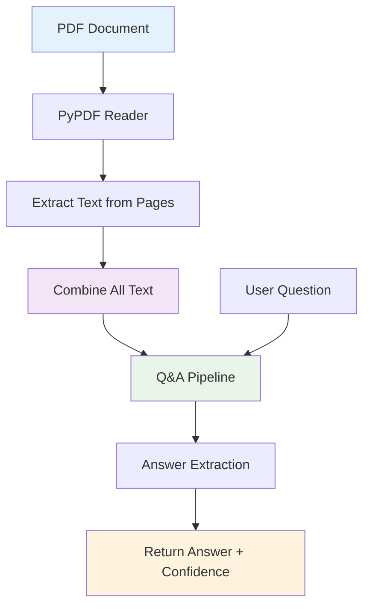
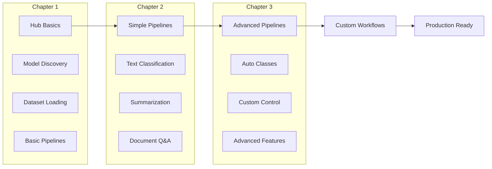

# 📚 Hugging Face Complete Course Summary

## 🎯 Tổng quan khóa học

Khóa học Hugging Face cung cấp kiến thức toàn diện về việc sử dụng các công cụ AI hiện đại để xây dựng các ứng dụng NLP thực tế, từ cơ bản đến nâng cao.

## 📋 Course Structure Overview

| Chapter | Topic | Key Focus | Practical Skills |
|---------|-------|-----------|------------------|
| **Chapter 1** | 🏠 **Hugging Face Hub & Foundations** | Platform basics, Models, Datasets | Hub navigation, Pipeline creation, Data preprocessing |
| **Chapter 2** | 🔧 **Advanced Pipelines** | Text Classification, Summarization, Document Q&A | Production workflows, Custom parameters |
| **Chapter 3** | ⚙️ **Auto Classes** | Models & Tokenizers | Custom control, Advanced workflows |

## 🚀 Chapter 1: Hugging Face Hub & Foundations

### 🏠 Hugging Face Hub
**Central platform cho AI models và datasets**

| Feature | Mô tả | Benefit |
|---------|-------|---------|
| **Model Discovery** | Tìm kiếm pre-trained models | Access to thousands of models |
| **Dataset Library** | Repository of datasets | Ready-to-use training data |
| **Model Sharing** | Upload và share models | Community collaboration |
| **Documentation** | Model cards với detailed info | Understanding model capabilities |

### 🔧 Pre-trained Models & Pipelines

```python
# Quick model usage
from transformers import pipeline

# Create pipeline
classifier = pipeline("sentiment-analysis")
result = classifier("I love this product!")
# Output: [{'label': 'POSITIVE', 'score': 0.9998}]
```

**Key Benefits:**
- ✅ **No training required**: Sử dụng ngay pre-trained models
- ✅ **Quick prototyping**: Rapid development workflows  
- ✅ **Production ready**: High-quality results out of the box

### 💾 Model Management

| Method | Purpose | Example |
|--------|---------|---------|
| `.save_pretrained()` | Lưu model locally | `model.save_pretrained("./my_model")` |
| `.from_pretrained()` | Load model từ Hub hoặc local | `model.from_pretrained("bert-base-uncased")` |
| `push_to_hub()` | Upload model lên Hub | `model.push_to_hub("my-awesome-model")` |

### 📊 Dataset Processing

```python
from datasets import load_dataset

# Load dataset
dataset = load_dataset("imdb")

# Filter data
filtered = dataset.filter(lambda x: len(x['text']) > 100)

# Select subset
subset = dataset.select(range(1000))
```

**Key Functions:**
- **`filter()`**: Lọc data theo conditions
- **`select()`**: Chọn subset của data
- **`map()`**: Transform data
- **`train_test_split()`**: Chia data thành train/test

## 🔧 Chapter 2: Advanced Pipelines

### 📝 Text Classification

**Gán nhãn hoặc categories cho text**

| Use Case | Example | Pipeline Task |
|----------|---------|---------------|
| **Sentiment Analysis** | Positive/Negative reviews | `"sentiment-analysis"` |
| **Topic Classification** | News categorization | `"text-classification"` |
| **Intent Detection** | Chatbot intent recognition | `"text-classification"` |
| **Language Detection** | Identify text language | `"text-classification"` |

```python
# Text Classification Pipeline
classifier = pipeline("text-classification", 
                     model="cardiffnlp/twitter-roberta-base-sentiment-latest")

texts = [
    "Sản phẩm này tuyệt vời!",
    "Dịch vụ khách hàng kém quá",
    "Bình thường, không có gì đặc biệt"
]

results = classifier(texts)
for text, result in zip(texts, results):
    print(f"Text: {text}")
    print(f"Label: {result['label']} (Confidence: {result['score']:.4f})")
```

### 📄 Text Summarization

**Rút gọn nội dung dài thành bản tóm tắt ngắn gọn**

| Type | Description | Best For |
|------|-------------|----------|
| **Extractive** | Chọn câu quan trọng từ text gốc | News articles, academic papers |
| **Abstractive** | Tạo summary mới với ngôn ngữ riêng | Creative content, reports |

```python
# Summarization Pipeline
summarizer = pipeline("summarization", 
                     model="facebook/bart-large-cnn")

long_text = """
Báo cáo tài chính quý 3 cho thấy doanh thu tăng 15% so với cùng kỳ năm trước.
Chi phí vận hành giảm 8% nhờ việc tối ưu hóa quy trình sản xuất.
Lợi nhuận ròng đạt 2.5 triệu USD, vượt kỳ vọng của các nhà phân tích.
Công ty dự kiến sẽ mở rộng thị trường quốc tế trong quý 4.
"""

summary = summarizer(long_text, 
                    max_length=50,    # Độ dài tối đa
                    min_length=20,    # Độ dài tối thiểu
                    do_sample=False)  # Deterministic output

print(f"Original length: {len(long_text)} characters")
print(f"Summary: {summary[0]['summary_text']}")
```

**Customization Parameters:**
- **`max_length`**: Giới hạn độ dài summary
- **`min_length`**: Độ dài tối thiểu
- **`do_sample`**: Random sampling (True) vs deterministic (False)
- **`num_beams`**: Beam search width cho quality

### ❓ Document Question Answering

**Trích xuất answers từ documents dựa trên questions**

#### 🔄 Document Q&A Workflow



#### 📝 Implementation Steps

**Step 1: Extract Text từ PDF**
```python
from pypdf import PdfReader

# Load PDF file
reader = PdfReader("US_Employee_Policy.pdf")

# Extract text from all pages
document_text = ""
for page in reader.pages:
    document_text += page.extract_text()

print(f"Extracted {len(document_text)} characters from PDF")
```

**Step 2: Setup Q&A Pipeline**
```python
from transformers import pipeline

# Initialize Q&A pipeline
qa_pipeline = pipeline(
    task="question-answering",
    model="distilbert-base-cased-distilled-squad"
)

# Ask questions
questions = [
    "What is the notice period for resignation?",
    "How many vacation days are allowed?",
    "What is the policy for remote work?"
]

for question in questions:
    result = qa_pipeline(question=question, context=document_text)
    
    print(f"Q: {question}")
    print(f"A: {result['answer']}")
    print(f"Confidence: {result['score']:.4f}")
    print(f"Start: {result['start']}, End: {result['end']}")
    print("-" * 50)
```

#### 🎯 Use Cases cho Document Q&A

| Domain | Use Case | Example Questions |
|--------|----------|-------------------|
| **Legal** | Contract analysis | "What are the termination clauses?" |
| **Finance** | Report analysis | "What is Q3 revenue?" |
| **HR** | Policy queries | "What is the maternity leave policy?" |
| **Customer Support** | FAQ automation | "How to reset password?" |
| **Research** | Paper analysis | "What methodology was used?" |

## ⚙️ Chapter 3: Auto Models và Tokenizers

### 🔧 Auto Classes Overview

| Component | Purpose | When to Use |
|-----------|---------|-------------|
| **AutoTokenizer** | Text preprocessing | Custom tokenization, special domains |
| **AutoModel** | Model loading | Fine-tuning, custom workflows |
| **AutoConfig** | Model configuration | Advanced customization |

### 🆚 Pipelines vs Auto Classes

| Aspect | Pipelines | Auto Classes |
|--------|-----------|--------------|
| **Ease of Use** | ⭐⭐⭐⭐⭐ Very simple | ⭐⭐⭐ Requires knowledge |
| **Flexibility** | ⭐⭐ Limited | ⭐⭐⭐⭐⭐ Highly flexible |
| **Control** | ⭐⭐ Automatic | ⭐⭐⭐⭐⭐ Full control |
| **Use Case** | Quick prototyping | Production, custom workflows |

```python
# Auto Classes Example
from transformers import AutoTokenizer, AutoModelForSequenceClassification

model_name = "distilbert-base-uncased-finetuned-sst-2-english"

# Load tokenizer và model
tokenizer = AutoTokenizer.from_pretrained(model_name)
model = AutoModelForSequenceClassification.from_pretrained(model_name)

# Preprocess input
text = "This movie is fantastic!"
inputs = tokenizer(text, return_tensors="pt", padding=True, truncation=True)

# Model inference
outputs = model(**inputs)
predictions = torch.nn.functional.softmax(outputs.logits, dim=-1)

print(f"Positive probability: {predictions[0][1].item():.4f}")
```

## 📊 Complete Learning Path Summary

### 🎯 Skills Progression



### 📈 Practical Applications Matrix

| Industry | Text Classification | Summarization | Document Q&A | Auto Classes |
|----------|-------------------|---------------|--------------|--------------|
| **E-commerce** | Product reviews sentiment | Product descriptions | FAQ automation | Custom models |
| **Finance** | Risk assessment | Report summaries | Regulatory compliance | Domain-specific |
| **Healthcare** | Medical record classification | Research summaries | Policy queries | Clinical models |
| **Legal** | Document categorization | Case summaries | Contract analysis | Legal-specific |
| **Media** | Content moderation | Article summaries | Archive search | Content models |

## 🛠️ Production Deployment Checklist

### ✅ Before Production

| Component | Considerations | Best Practices |
|-----------|----------------|----------------|
| **Model Selection** | Task fit, performance, size | Benchmark multiple models |
| **Data Pipeline** | Preprocessing, validation | Robust error handling |
| **Infrastructure** | GPU/CPU, memory, latency | Load testing, monitoring |
| **Security** | Data privacy, model protection | Encryption, access control |
| **Monitoring** | Performance tracking, alerts | Real-time metrics |

### 🚀 Deployment Strategies

```python
# Production-ready pipeline example
import logging
from typing import Dict, List
from transformers import pipeline

class ProductionQASystem:
    def __init__(self, model_name: str):
        self.qa_pipeline = pipeline(
            "question-answering",
            model=model_name,
            device=0 if torch.cuda.is_available() else -1
        )
        self.logger = logging.getLogger(__name__)
    
    def answer_question(self, question: str, context: str) -> Dict:
        try:
            result = self.qa_pipeline(
                question=question,
                context=context,
                max_answer_len=100,
                handle_impossible_answer=True
            )
            
            self.logger.info(f"Answered question: {question[:50]}...")
            return {
                "answer": result["answer"],
                "confidence": result["score"],
                "success": True
            }
            
        except Exception as e:
            self.logger.error(f"Error processing question: {e}")
            return {
                "answer": "Unable to process question",
                "confidence": 0.0,
                "success": False,
                "error": str(e)
            }

# Usage
qa_system = ProductionQASystem("distilbert-base-cased-distilled-squad")
result = qa_system.answer_question("What is the policy?", document_text)
```

## 🎓 Key Takeaways

### 💡 Essential Concepts

1. **Hub-first Approach**: Tận dụng pre-trained models và datasets
2. **Pipeline Simplicity**: Quick prototyping với minimal code
3. **Auto Classes Power**: Advanced control khi cần customization
4. **Document Processing**: Combine PyPDF + Q&A cho real applications
5. **Production Readiness**: Error handling, monitoring, scalability

### 🚀 Next Steps

- **Advanced Fine-tuning**: Customize models cho specific domains
- **Multi-modal Applications**: Combine text với images/audio  
- **Large Language Models**: Explore GPT, LLaMA variants
- **Deployment Optimization**: TensorRT, ONNX, quantization
- **MLOps Integration**: CI/CD cho ML workflows

---

**🎉 Congratulations!** Bạn đã hoàn thành journey từ Hugging Face basics đến advanced applications. Đây chỉ là bước đầu trong AI adventure! 🚀

**💪 Keep Learning:** Hugging Face ecosystem không ngừng phát triển - continue exploring và building amazing AI applications!

---

**📚 Course Completion Summary:**
- ✅ **Foundation Skills**: Hub navigation, basic pipelines
- ✅ **Practical Applications**: Text classification, summarization, Q&A
- ✅ **Advanced Techniques**: Auto classes, custom workflows
- ✅ **Production Knowledge**: Deployment, monitoring, best practices

**🚀 You're now ready to build production-grade AI applications with Hugging Face!**
